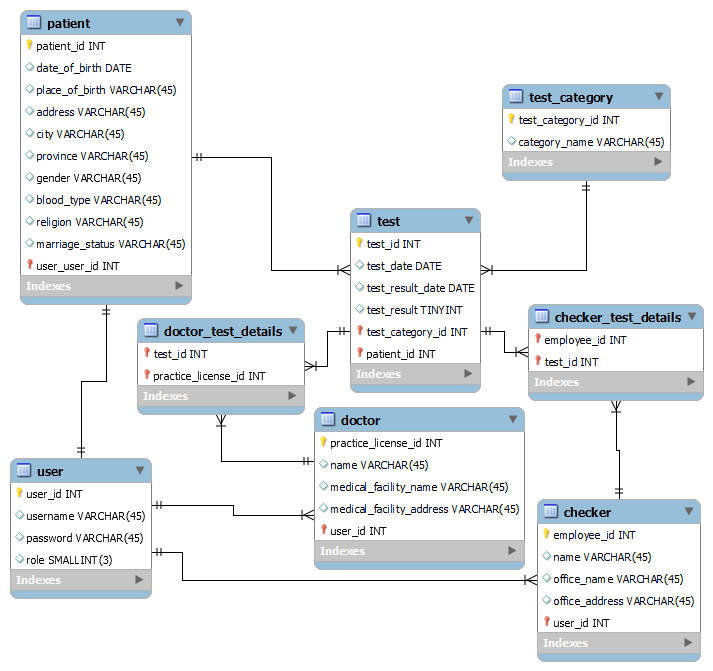

# C-Track

Alterra Academy Final Project : API Covid19 Track
## Contents
- [Introduction](#introdction)
- [Features](#features)
- [Wireflow](#wireflow)
- [ERD](#ERD)
- [API Doc](#api-doc)
- [How to use](#how-to-use)
- [Credits](#credits)

## Introduction

The Project is a mobile application to tracking test results of Covid-19. This project was developed using Golang, Echo, Gorm, MySQLfor  database, and deployment using google cloud. 

## Features 
The features of C-Track :
* User can Register and Login
  
  |      User     |
  |:-------------:|
  | Patient       |
  | Doctor        |
  | Checker       |

* Patient can see history of Covid-19 test results
* Doctor can input patient test results
* Checker can see history of patient test results

## Wireflow
The flow of C-Track mobile application is :

## ERD (Entity Relation Diagram)
In this app have 8 tables to save data, there are :

## API Documentation
To see API Documentation, you can go to https://github.com/pebruwantoro/C-Track_OpenAPI
## How To Use
How to run this project :

1. Clone this repository in your $PATH with git clone https://github.com/inasalifatus/c-track.git
2. And then cd c-track and make sure you have installed Go and MySQL in your machine.
3. Run command go run main.go 

## Credits

- [Faris Jourdy Ramadhan](https://github.com/farisjr)
- [Ivan Susiyanto](https://github.com/ivanscloud)
- [Doni Pebruwantoro](https://github.com/pebruwantoro)
- [Inas Alifatus Salma](https://github.com/inasalifatus)

